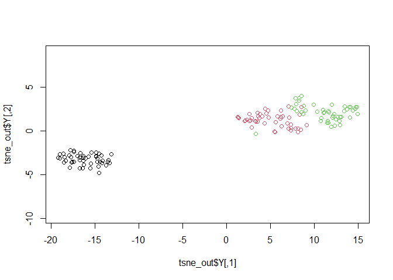

<!-- README.md is generated from README.Rmd. Please edit that file -->

# stsne

<!-- badges: start -->
<!-- badges: end -->

The goal of stsne is to Supervised learning for t-Distributed Stochastic
Neighbor Embedding

## Installation

To install the latest version from the github repository, use:

``` r
if(!require(devtools)) install.packages("devtools") # If not already installed
devtools::install_github("chenxuepu/stsne")
```

<!--You can install the released version of stsne from [CRAN](https://CRAN.R-project.org) with:-->

## Usage

After installing the package, use the following code to run a simple
example (to install, see below).

``` r
library(stsne) # Load package
iris_unique <- unique(iris) # Remove duplicates
set.seed(42) # Sets seed for reproducibility
tsne_out <- stsne(as.matrix(iris_unique[,1:4])) # Run TSNE
plot(tsne_out$Y,col=iris_unique$Species,asp=1) # Plot the result
```



# Details

This R package modify Rtsne package to Supervised learning.

# References

\[1\] L.J.P. van der Maaten and G.E. Hinton. “Visualizing
High-Dimensional Data Using t-SNE.” Journal of Machine Learning Research
9(Nov):2579-2605, 2008.

\[2\] L.J.P van der Maaten. “Accelerating t-SNE using tree-based
algorithms.” Journal of Machine Learning Research 15.1:3221-3245, 2014.

\[3\] <https://lvdmaaten.github.io/tsne/>
